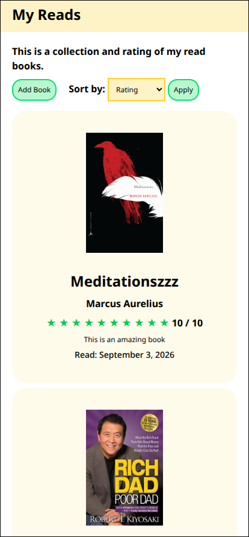
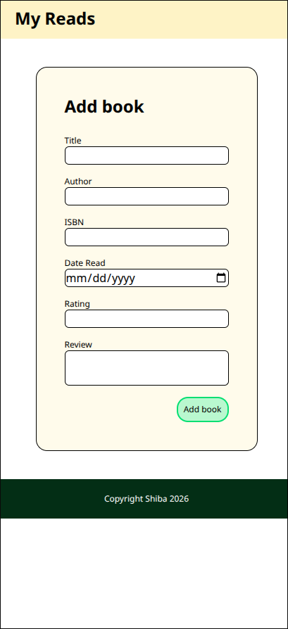
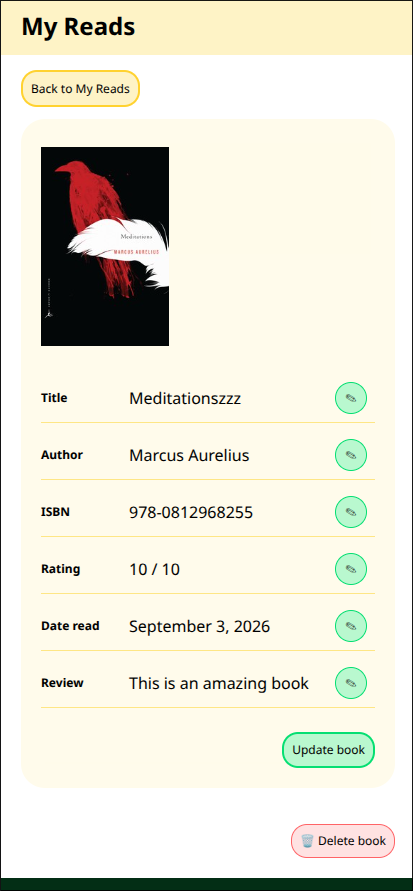

# Book Notes Project

A small Express and PostgreSQL application for recording books, ratings, reviews, ISBNs, and read dates.

## Features

- View saved books
- Add a book
- Sort books by different fields
- Open an individual book page
- Edit book details
- Delete a book
- Display ratings as stars
- Format read dates for display

## Screenshots

### Home page



### Add a book



### Edit a book



## Technologies

- Node.js
- Express
- EJS
- PostgreSQL
- Tailwind CSS

## Setup

From this directory, install the dependencies:

```bash
npm install
```

Create a PostgreSQL database using [`queries.sql`](queries.sql):

```bash
psql -f queries.sql
```

The server reads environment variables from a `.env` file one directory above this project. Add the PostgreSQL connection values there:

```env
DB_USER=your_postgres_user
DB_HOST=localhost
DB_PASSWORD=your_postgres_password
DB_PORT=5432
```

Build the Tailwind stylesheet:

```bash
npx @tailwindcss/cli -i ./public/styles/input.css -o ./public/styles/output.css
```

Start the server:

```bash
node index.js
```

Open [http://localhost:3000](http://localhost:3000) in a browser.

## Routes

| Method | Route               | Description                                 |
| ------ | ------------------- | ------------------------------------------- |
| `GET`  | `/`                 | View all books                              |
| `GET`  | `/add`              | Show the add-book form                      |
| `POST` | `/add`              | Add a book                                  |
| `GET`  | `/filter`           | Sort books using the `sort` query parameter |
| `GET`  | `/books/:id`        | View one book                               |
| `POST` | `/books/:id/update` | Update a book                               |
| `POST` | `/books/:id/delete` | Delete a book                               |
